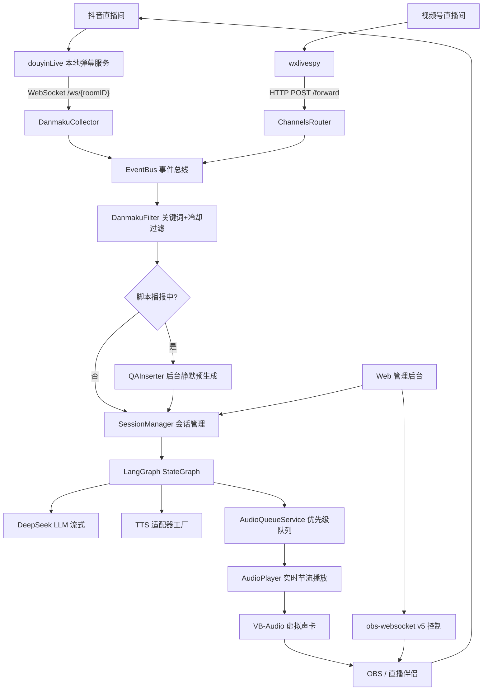
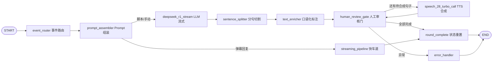

# AI 云端口播直播系统

基于 **LangGraph 混合架构** 的 AI 直播主播系统。监听直播间弹幕，由 LLM 实时生成带货话术，经 TTS 合成后通过虚拟声卡推流到 OBS / 直播伴侣，支持**脚本播报中弹幕问答不打断、句尾无缝插入、播完自动续读脚本**。

全链路 asyncio 协程：监听 / 生成 / 合成 / 播放各自独立，互不阻塞。

---

## ⚠️ 使用前置声明

本项目是**技术实现示例**，用于学习 LangGraph 编排、流式 TTS 流水线与实时音频处理。

在实际直播中使用，你必须自行确保：

1. **显著标识 AI 生成内容**。依据《互联网信息服务深度合成管理规定》《生成式人工智能服务管理暂行办法》，AI 合成的语音 / 视频需以显著方式提示公众。本项目不提供、也不应被用于隐藏 AI 身份的功能。
2. **遵守直播平台规则**。各平台对 AI 直播、录播、无人直播有明确规范，违规后果由使用者自行承担。
3. **声音克隆必须取得声音权人的书面授权**。《民法典》第 1023 条对声音权益参照肖像权保护。本项目不在代码内做音频上传克隆，需你在服务商官网自行完成并确认授权链路完整。
4. **API Key 与账号安全**。所有密钥仅存于本地 `.env`，`.env` 及 `.env.*` 已在 `.gitignore` 中，请勿提交。

---

## 核心特性

### 🎙️ 三家 TTS 引擎后台一键热切换

| 引擎 | 协议 | 特点 |
|---|---|---|
| **MiniMax** Speech-2.8-Turbo | HTTP | 支持 `(breath)` / `(chuckle)` 等 19 种口语化标注；支持在本项目后台内直接做声音克隆 |
| **火山引擎** Seed-TTS 2.0 | V3 双向流式 WebSocket | 自定义二进制帧协议；支持整体情绪 `context_texts`；中文带货自然度高 |
| **ElevenLabs** | HTTP chunked streaming | 70+ 语种；多模型可选（v3 / Multilingual v2 / Flash v2.5）；429 退避重试 |

切换厂商时，音色列表、模型列表、口语化标注开关、试听采样率全部自动适配；跨厂商残留的音色 ID 会被自动清除。

### 💬 预就绪伺机插入式打断续播

脚本播报中收到弹幕提问时**不打断当前播报**：后台静默预生成回答音频，就绪后由 TTS 循环在**句尾**插入，播完自动从断点续读脚本下一句。观众听感是「主播说完这句顺口答了个问题，然后接着讲」，而不是「主播被打断了」。

### 🧠 LangGraph 双链路编排

- **快车道**：弹幕回复走 `streaming_pipeline`，LLM 流式输出 → 边分句 → 边并行合成，首音延迟最低
- **串行链路**：脚本播报走 LLM → 分句 → 口语化标注 → 人工审核门 → TTS 循环

### 🔌 插件化适配器

LLM / TTS / OBS 全部走抽象基类，换厂商只改工厂层，上层业务代码零改动。新增一家 TTS 引擎约需改动 12 个文件的分支点，详见 [新增 TTS 引擎](#新增-tts-引擎)。

### 🖥️ Web 管理后台（五个 Tab）

直播控制 · 试听试播 · 音色克隆 · 配置管理 · 监控。所有配置**运行时热更新**，无需重启进程。

### 📊 成本用量监控

`UsageTracker` 在各适配器发起请求前埋点，按厂商单价折算，监控页实时成本看板。

---

## 系统架构



### LangGraph 编排流程



**TTS 循环的协作式打断**：`should_continue_tts` 每次迭代都检查全局中断标志，检测到打断立即退出循环，交给 `round_complete` 把已播报内容写入记忆并清理状态，保证续接上下文准确。

---

## 目录结构

```
├── main.py                       # 主入口：启动全部协程 + uvicorn
├── config/settings.py            # 12 个配置组，pydantic-settings 从 .env 加载
├── adapters/                     # 外部服务适配器（插件层）
│   ├── base.py                   #   BaseTTSAdapter 抽象基类
│   ├── deepseek_adapter.py       #   LLM（SSE 流式解析）
│   ├── speech_adapter.py         #   MiniMax TTS
│   ├── volcengine_tts_adapter.py #   火山 Seed-TTS 2.0（V3 双向流式 WebSocket）
│   ├── elevenlabs_tts_adapter.py #   ElevenLabs（HTTP chunked streaming）
│   └── obs_websocket_adapter.py  #   OBS 推流控制（obs-websocket v5）
├── graph/                        # LangGraph 编排层
│   ├── builder.py                #   StateGraph 组装（10 节点 + 条件边）
│   ├── state.py                  #   LiveState / RunMode / AudioTask
│   └── nodes/                    #   各业务节点
├── scheduler/                    # 实时事件与调度层
│   ├── collectors/               #   弹幕采集（抖音 douyinLive / 定时）
│   ├── event_bus.py              #   事件总线
│   ├── session_manager.py        #   会话生命周期 + Graph 调用
│   ├── interrupt_controller.py   #   全局抢占中断
│   ├── danmaku_filter.py         #   关键词过滤 + 冷却
│   ├── qa_inserter.py            #   预就绪伺机插入
│   ├── viewer_pool.py            #   观众昵称池（随机点名）
│   ├── product_knowledge.py      #   商品知识库（仅问答链路注入）
│   └── usage_tracker.py          #   成本用量统计
├── services/                     # 业务服务层
│   ├── tts_factory.py            #   TTS 适配器工厂
│   ├── streaming_pipeline.py     #   弹幕回复快车道
│   ├── text_enricher_service.py  #   口语化标注 Agent
│   ├── voice_clone_service.py    #   MiniMax 声音克隆
│   ├── volcengine_voice_service.py
│   └── elevenlabs_voice_service.py
├── output/                       # 音频输出层
│   ├── audio_queue.py            #   优先级音频队列（按 sentence_index 排序）
│   ├── audio_player.py           #   实时节流播放 + 淡出
│   └── virtual_sound_card.py     #   虚拟声卡设备枚举与写入
├── web/                          # FastAPI 管理后台
│   ├── app.py                    #   create_app() 工厂
│   └── routers/                  #   8 个路由模块
├── data/                         # 音色表 / 商品知识库
├── common/                       # 日志、异常、昵称格式化
├── static/index.html             # 单页管理后台
└── tests/                        # pytest 单元测试
```

---

## 快速开始

### 1. 环境要求

- **Python 3.10+**
- **Windows 10 / 11** — 虚拟声卡与音频写入链路依赖 Windows 音频栈
- **VB-Audio Virtual Cable**（免费）— 把 TTS 音频路由给 OBS
- **OBS Studio 28+**（内置 obs-websocket v5，无需额外插件）或抖音直播伴侣
- **弹幕源**（按需选装）
  - 抖音：douyinLive 本地弹幕服务（把抖音 protobuf 弹幕转成 WebSocket JSON 推送）
  - 视频号：wxlivespy（HTTP 转发）

### 2. 安装

```powershell
conda create -n douyin-zhibo python=3.10 -y
conda activate douyin-zhibo

git clone https://github.com/NeuraEcho/DOUYIN-zhibo.git
cd DOUYIN-zhibo

pip install -r requirements.txt
```

### 3. 配置

```powershell
copy .env.example .env
```

编辑 `.env`，至少填这几项：

```ini
# LLM
DEEPSEEK_API_KEY=你的Key

# TTS（三家任选，未用到的留空即可，不影响启动）
SPEECH_API_KEY=MiniMax的Key
VOLCENGINE_API_KEY=火山的Key
ELEVENLABS_API_KEY=ElevenLabs的Key

# 弹幕源
ROOM_ID=你的直播间号
PLATFORM_WS_URL=ws://127.0.0.1:8080

# 音频
VIRTUAL_SOUND_CARD_NAME=CABLE Input (VB-Audio Virtual Cable)
AUDIO_SAMPLE_RATE=24000
```

`.env.example` 里每一项都带了注释和取值范围说明，包含全部 12 个配置组。

> ⚠️ **采样率契约**：`AUDIO_SAMPLE_RATE` 必须与所选 TTS 引擎的输出采样率一致，否则播放会变调变速。ElevenLabs 的采样率由 `ELEVENLABS_OUTPUT_FORMAT` 自动推导，不需要单独配。

### 4. 商品知识库（可选但强烈建议）

```powershell
copy data\product_knowledge.example.json data\product_knowledge.json
```

`product_knowledge.json` 是 LLM 回答观众提问的**唯一事实依据**，Prompt 已明确禁止编造此处没有的价格 / 规格 / 材质 / 库存 / 优惠。资料里没写的，AI 会如实回答「这个暂时不清楚」并引导观众看商品详情页。

也可以启动后在后台「配置管理」直接编辑，那里是热更新的。

### 5. 启动

```powershell
python main.py
```

浏览器打开 <http://127.0.0.1:8000> 进入管理后台。控制台会同时打印局域网访问地址（供手机 / 其他设备调试）。

### 6. 接通音频链路

1. 装好 VB-Audio Virtual Cable，重启电脑
2. Windows 声音设置里确认出现 `CABLE Input` / `CABLE Output`
3. OBS 添加「音频输出采集」源，设备选 **CABLE Output**（不是 Input）
4. 后台「配置管理」填入 OBS 的 obs-websocket 密码（OBS 菜单：工具 → obs-websocket 设置）
5. 后台「直播控制」→ 一键推流

---

## Web 管理后台

| Tab | 能力 |
|---|---|
| **直播控制** | 启动 / 停止 / 手动打断、手动下发文本、循环口播模式、OBS 推流控制 |
| **试听试播** | 话术试听（纯 TTS）、试播模式（LLM+TTS 全链路）、模拟弹幕提问 |
| **音色克隆** | MiniMax 项目内克隆；火山 / ElevenLabs 在线音色列表浏览与切换 |
| **配置管理** | 主播人设 Prompt、TTS 厂商与参数、直播间号、弹幕过滤规则、商品知识库、点名兜底名池 |
| **监控** | 系统状态、音频队列水位、实时日志、健康检查、成本用量看板 |

所有配置修改**立即生效**。运行时配置存于内存，重启进程会回落到 `.env` 默认值。

---

## API 一览

启动后访问 <http://127.0.0.1:8000/docs> 查看完整 Swagger 文档。

| 分组 | 前缀 | 主要端点 |
|---|---|---|
| 直播控制 | `/api/live` | `POST /start` `/stop` `/interrupt` `/manual_input` |
| 配置管理 | `/api/config` | `GET`/`PUT` `/prompt` `/tts` `/tts-provider` `/room-id` `/danmaku-filter` `/product` `/viewer-pool` `/fallback-names` `/context-text` `/elevenlabs` |
| 音色克隆 | `/api/voice-clone` | `GET /system-voices`、`POST /clone`、`/volcengine/*`、`/elevenlabs/*` |
| 试听试播 | `/api/preview` | `POST /tts-preview` `/test-broadcast` `/simulate-danmaku` |
| OBS 推流 | `/api/obs` | `POST /stream/start` `/stream/stop` `/scene` `/stream-service` `/one-click` `/test` |
| 监控 | `/api/monitor` | `GET /status` `/audio-queue` `/logs` `/health` `/usage`、`POST /usage/reset` |
| 视频号弹幕 | `/forward` | `POST /forward`、`POST /api/channels/forward`、`GET /api/channels/status` |

---

## 弹幕源对接

### 抖音（douyinLive）

`DanmakuCollector` 连接 `ws://{host}:{port}/ws/{roomID}`，解析 douyinLive 推送的两类 JSON：

- **系统状态**：`type="system"`，含开播 / 未开播 / 下播 / 无效房间 / 风控状态
- **业务消息**：按 `method` 分发 —— `WebcastChatMessage`（弹幕）、`WebcastGiftMessage`（礼物）、`WebcastMemberMessage`（进场）、`WebcastSocialMessage`（关注）、`WebcastLikeMessage`（点赞）等

礼物与进场观众的昵称会进入 `ViewerPool`，供话术随机点名（点赞属高频事件，不入池以免刷屏挤占昵称池）。

改直播间号：后台「配置管理」修改 `ROOM_ID` → 触发 `reconnect()` 用新房间号重连，无需重启。

### 视频号（wxlivespy）

wxlivespy 默认把弹幕 HTTP 转发到 `POST /forward`，本项目的 `channels_router` 直接命中该路径，**零配置**。

---

## 打断与续接机制

系统有**两套语义清晰分离**的中断机制：

| 机制 | 用途 | 粒度 |
|---|---|---|
| LangGraph `interrupt` | 人工审核 / 优雅暂停 | 节点边界 |
| 全局 `abort` 抢占 | 弹幕实时打断 | 任务级强制终止 |

**预就绪伺机插入**（`QAInserter`）是核心亮点：

```
脚本播报中 → 弹幕提问命中关键词
  ↓
不打断、不新建会话
  ↓
后台静默预生成回答音频（LLM + TTS，超时 15s 静默丢弃）
  ↓
就绪后，脚本 TTS 循环在当前句尾插入回答
  ↓
插入静音间隔 0.25s
  ↓
从 breakpoint_idx 续读脚本下一句
```

> **关键约束**：弹幕回复**绝不参与**脚本断点追踪，不能调用 `update_breakpoint()`。否则回复的句子序号（从 0 开始）会污染脚本播报的 `breakpoint_idx`，导致续接时从错误位置开始、重复播报已播过的脚本句子。

可调参数（`.env` 的 `QA_*`）：`QA_ENABLED` · `QA_PREGEN_TIMEOUT_SECONDS` · `QA_MAX_SKIP_SENTENCES` · `QA_PREBUFFER_SENTENCES` · `QA_ANSWER_TRAILING_GAP_SECONDS`

---

## 音频链路硬约束

`AudioPlayer` 按 **16-bit 单声道裸 PCM** 消费音频：

```python
np.frombuffer(data, dtype=np.int16)   # 奇数字节会直接抛异常
```

因此所有 TTS 适配器必须保证**每个音频分片都是偶数字节长度**。网络分包边界是任意的，ElevenLabs 适配器用跨包的 `carry` 缓冲处理半字节余量。

播放节流 `_pace_realtime` 按「累积音频时长 vs 墙钟」对齐，`denom = sample_rate × channels × 2`，前置领先量 0.35s。

---

## 新增 TTS 引擎

provider 分支点散落在 **15 处 / 12 个文件**，漏掉任何一处都会出现「切到新厂商后行为不对」的诡异 bug：

| 类别 | 文件 |
|---|---|
| 配置与异常 | `config/settings.py`、`common/exceptions.py` |
| 适配器与数据 | `adapters/{provider}_tts_adapter.py`、`data/{provider}_voices.py`、`services/{provider}_voice_service.py` |
| 工厂 | `services/tts_factory.py` |
| 路由 | `web/routers/config_router.py`（白名单常量 `_SUPPORTED_TTS_PROVIDERS`、`_runtime_config`、`get_tts_config`、`set_tts_provider`）、`voice_clone_router.py`、`preview_router.py`（`_DIRECT_SYNTH_PROVIDERS`） |
| **图节点** | `graph/nodes/tts_synthesize.py`、**`graph/nodes/text_enricher.py`（最易漏）** |
| 管线与调度 | `services/streaming_pipeline.py`、`scheduler/qa_inserter.py`、`scheduler/usage_tracker.py` |
| 前端 | `static/index.html` |

两条容易踩的判断标准：

1. **是否归入 `_DIRECT_SYNTH_PROVIDERS`**（即跳过 MiniMax 口语化标注）—— 判据是「该厂商是否识别项目注入的 `(breath)` / `(chuckle)` 圆括号语法」，而不是厂商知名度。火山和 ElevenLabs 都不识别，会被当正文念出来。
2. **适配器 `__init__` 只 log 不抛**，配置校验延迟到 `synthesize()` 首行的 `_ensure_ready()`。因为 `tts_synthesize.py` 的 `create_tts_adapter()` 在 `try` 块**之外**，构造时抛异常会直接击穿 LangGraph 节点。

---

## 常见问题

**Q：有声音但直播间听不到？**
检查 VB-Audio 是否装好、OBS 音频源是否选的 `CABLE Output`（不是 `CABLE Input`）。

**Q：播放变调 / 变速 / 是噪声？**
采样率不一致。确认 `AUDIO_SAMPLE_RATE` == 所选 TTS 引擎的输出采样率，且 TTS 输出格式是 PCM（ElevenLabs 必须是 `pcm_*`，mp3 / opus 会变噪声）。

**Q：`np.frombuffer` 报奇数字节错误？**
某个音频分片长度是奇数，检查适配器的字节对齐逻辑。

**Q：弹幕收不到？**
① douyinLive 进程是否在跑、黑窗口是否被关掉；② `ROOM_ID` 是否正确；③ 弹幕是否命中 `DANMAKU_INTERRUPT_KEYWORDS`（未命中会被过滤）；④ 是否在冷却期内（默认 3 秒）；⑤ 弹幕字数是否少于 `DANMAKU_MIN_TEXT_LENGTH`。

**Q：火山报 `code=55000000 resource ID is mismatched`？**
音色与 resource_id 不匹配。预置音色走 `seed-tts-2.0`，`S_` 开头的克隆音色走 `seed-icl-2.0`，且必须是本账号有权访问的资源。

**Q：ElevenLabs 报「连不上 ElevenLabs」？**
`api.elevenlabs.io` 在境外，国内直连常超时。把 `ELEVENLABS_BASE_URL` 改成可用的中转地址。

**Q：ElevenLabs 报 429？**
本月字符额度用尽，或并发请求数超过套餐上限。注意 Free 套餐 Multilingual v2 并发只有 2，而本项目有「后台预生成 + 主管线」两条并行合成路径，容易撞上限。适配器已内置退避重试（优先遵循 `Retry-After`），但会引入可感知延迟。建议改用 Flash 模型（并发额度翻倍 + 价格减半）或升级套餐。

**Q：改了 `.py` 不生效？**
必须重启 `python main.py`。只有后台页面上改的配置是热更新的。

---

## 已知限制

- **仅支持 Windows**。虚拟声卡与音频写入链路依赖 Windows 音频栈。
- **LLM 目前只实现了 DeepSeek 适配器**。接口是通用的 OpenAI 兼容 SSE 格式，换其他厂商需新写适配器。
- **TTS 是「按句」流式，不是「按字节」流式**。`BaseTTSAdapter.synthesize()` 返回 `list[bytes]`，整句合成完才入队播放 —— 三家引擎行为一致。网络层是真流式（边收边做字节对齐、`cancel_check` 每个分片都检查，因此打断响应很快），但首字延迟等于整句生成时间。
- **运行时配置存内存**，重启进程回落到 `.env`。
- **ElevenLabs 不在项目内做声音克隆**，需在官网完成后回来选音色 ID。
- **句间换气间隔目前是火山专属**（`_enqueue_block_gap` 以 `VOLCENGINE_ENCODING == pcm` 为门控），MiniMax 与 ElevenLabs 不享受。

## Roadmap

- [ ] `BaseTTSAdapter` 增加 `synthesize_stream()` 可选方法，实现按字节流式播放（需同步重验打断续接的 `sentence_index` 时序语义）
- [ ] ElevenLabs WebSocket 流式接口（`stream-input`）—— 官方口径下 WebSocket 只在模型真正生成音频时占并发额度，HTTP 则每个请求都占
- [ ] LLM 适配器插件化，支持多厂商热切换
- [ ] 运行时配置持久化到本地文件
- [ ] 句间换气间隔泛化到全部 TTS 引擎

---

## 技术栈

| 层面 | 选型 |
|---|---|
| 编排 | LangGraph · LangChain |
| Web | FastAPI · Uvicorn · SSE-Starlette |
| 异步 IO | httpx · websockets · asyncio |
| 音频 | NumPy · SoundDevice |
| 配置 | Pydantic v2 · pydantic-settings · python-dotenv |
| 调度 | APScheduler |
| 日志 | Loguru |
| 推流 | obs-websocket v5 |
| 测试 | pytest · pytest-asyncio |

---

## 运行测试

```powershell
pytest tests/ -v
```

---

## License 与免责声明

本项目仅供学习交流。使用前请阅读文首「使用前置声明」一节，并自行确认符合当地法律法规与直播平台规则。

因使用本项目产生的任何账号处罚、法律责任或经济损失，作者不承担责任。
